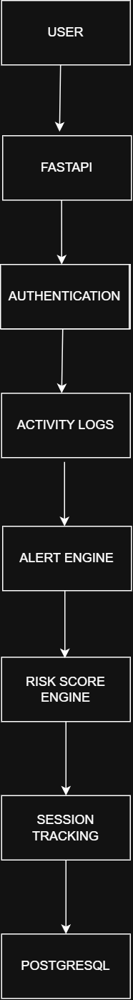
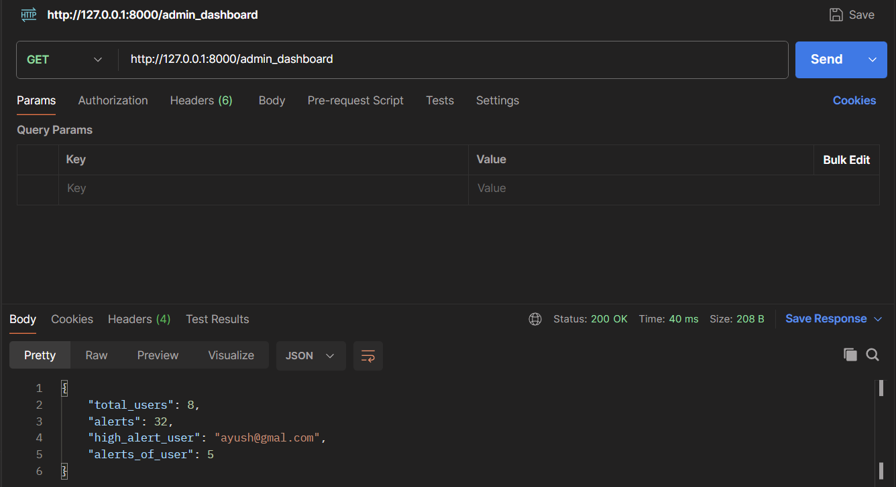
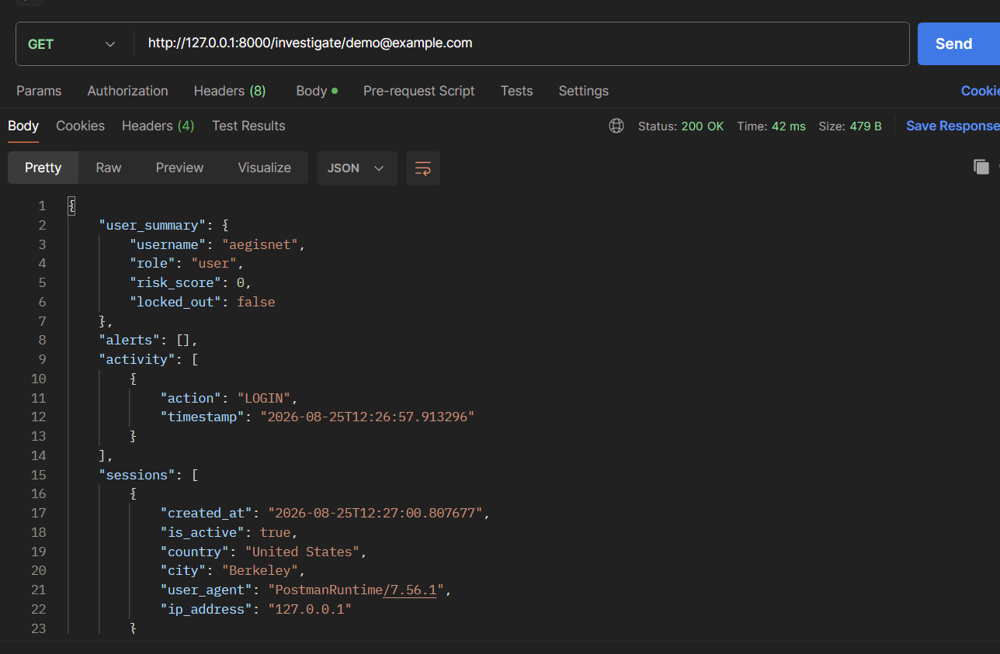
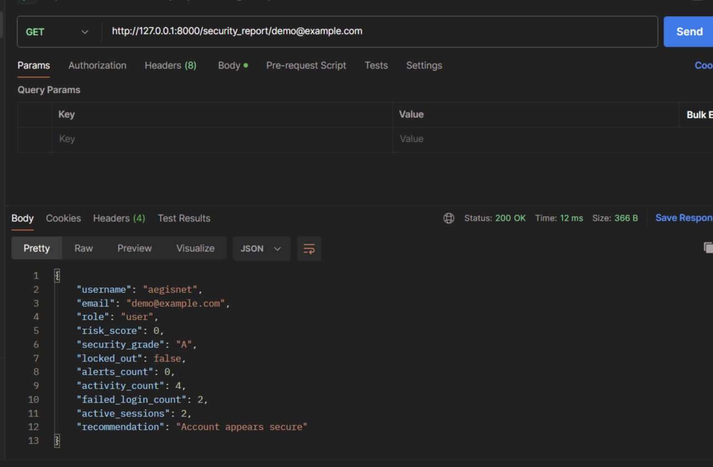
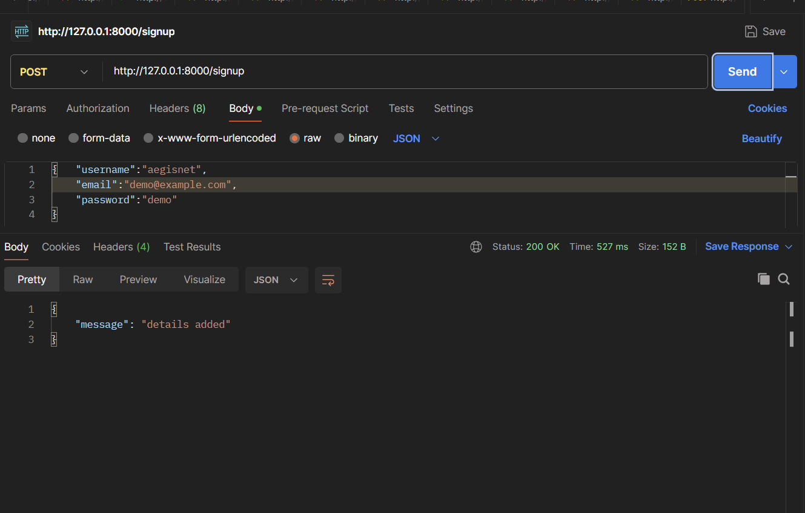
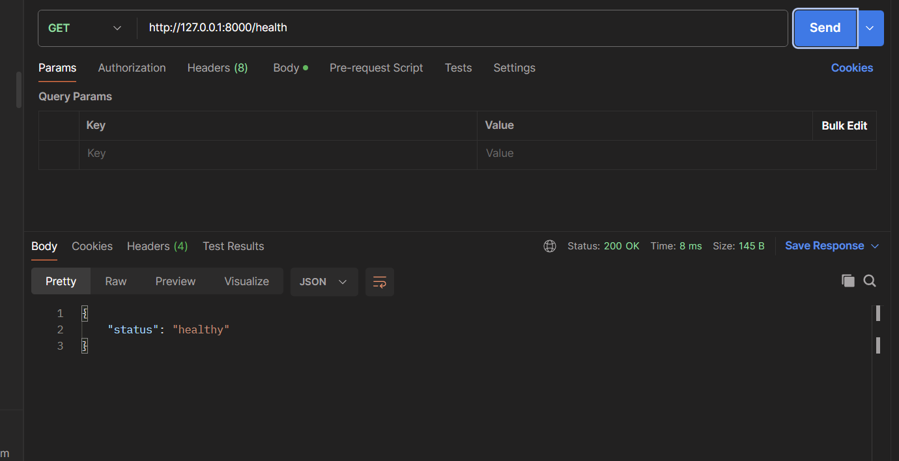

#  AegisNet

-----> Security monitoring and threat detection backend built with FastAPI, PostgreSQL, Redis, Docker, and CI/CD.

 **[Live API](https://aegisnet-v15o.onrender.com/)**  
 **[Swagger Docs](https://aegisnet-v15o.onrender.com/docs)**


AegisNet is a backend security platform that monitors user activity, detects suspicious behavior, generates security alerts, tracks sessions, and provides APIs for security investigation and reporting.


##  Features

-  JWT authentication & bcrypt password hashing
-  Role-Based Access Control (RBAC)
-  Activity logging
-  Security alert generation
-  Risk scoring & security grades
-  Automatic account lockout
-  Redis-based failed login tracking with TTL
-  Session tracking & session management
-  User investigation APIs
-  Security dashboard & reporting APIs
-  Real-time security alerts with WebSockets
-  Docker & Docker Compose
-  GitHub Actions CI/CD
-  Automated testing with Pytest
-  FastAPI Swagger/OpenAPI documentation

##  Architecture



##  Tech Stack

**Backend**
- Python
- FastAPI
- SQLModel
- PostgreSQL
- Redis

**Security**
- JWT
- Bcrypt
- RBAC
- Risk Scoring
- Account Lockout
- Session Tracking

**DevOps & Testing**
- Docker
- Docker Compose
- GitHub Actions
- Pytest
- Postman

## Redis Integration

Redis is used for temporary failed-login counters instead of repeatedly querying PostgreSQL.

- Fast failed-login tracking
- Automatic TTL expiration
- Reduced database queries during authentication
- Supports scalable authentication workflows

##  Key APIs

| /signup ( POST )---> Register a user 
| /login ( POST)  --->Authenticate a user 
| /viewuser  (GET )--->View authenticated user 
| /viewlogs (GET) --->View activity logs 
| /viewalerts  (GET) ---> View security alerts 
| /admin_dashboard  (GET)  --->Security dashboard statistics 
| /investigate/{email} ( GET) ---> Investigate user security data 
| /security_report/{email}  (GET) ---> Generate security report 
| /unlock_user  (POST)  --->Unlock locked account 
| /my_sessions  (GET) --->View user sessions 
| /logout_sessions  (POST) ---> Logout a session 
| /logout_all/{email}  (DELETE) ---> Logout all sessions 
| /ws/alerts----> WebSocket Real-time security alerts 

##  Docker

Run the application using Docker Compose:

```bash
docker compose up --build
```

##  CI/CD

GitHub Actions is used to automate testing and validation whenever changes are pushed to the repository.

##  Testing

Run the test suite with:

```bash
pytest
```

##  Run Locally

Clone the repository:

```bash
git clone <your-repository-url>
cd AegisNet
```

Create a virtual environment:

```bash
python -m venv venv
```

Activate it on Windows:

```bash
venv\Scripts\activate
```

Install dependencies:

```bash
pip install -r requirements.txt
```

Create a `.env` file with the required environment variables:

```env
SECRET_KEY=your_secret_key
DATABASE_URL=your_database_url
REDIS_URL=your_redis_url
```

Start the API:

```bash
uvicorn main:app --reload
```

Swagger documentation:

`http://127.0.0.1:8000/docs`

##  Screenshots

### Security Dashboard


### User Investigation


### Security Report


### Signup API


### Health Check



##  Project Status

**Current Version: v1.1**


### Latest Improvements

- Integrated Redis for high-performance failed-login tracking
- Added TTL-based temporary login counters
- Reduced repeated database queries during authentication
- Added Docker & Docker Compose
- Added GitHub Actions CI/CD
- Added security investigation and reporting APIs
- Added real-time WebSocket alerts
- Improved backend performance and scalability

##  Author

**Anjana Nv**  

B.Tech Computer Science Engineering.


