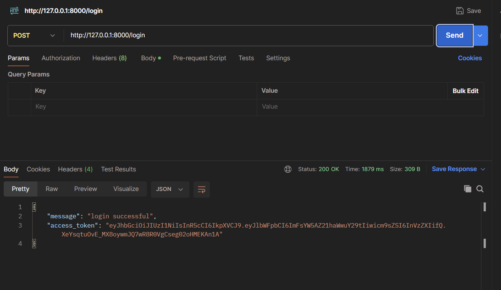
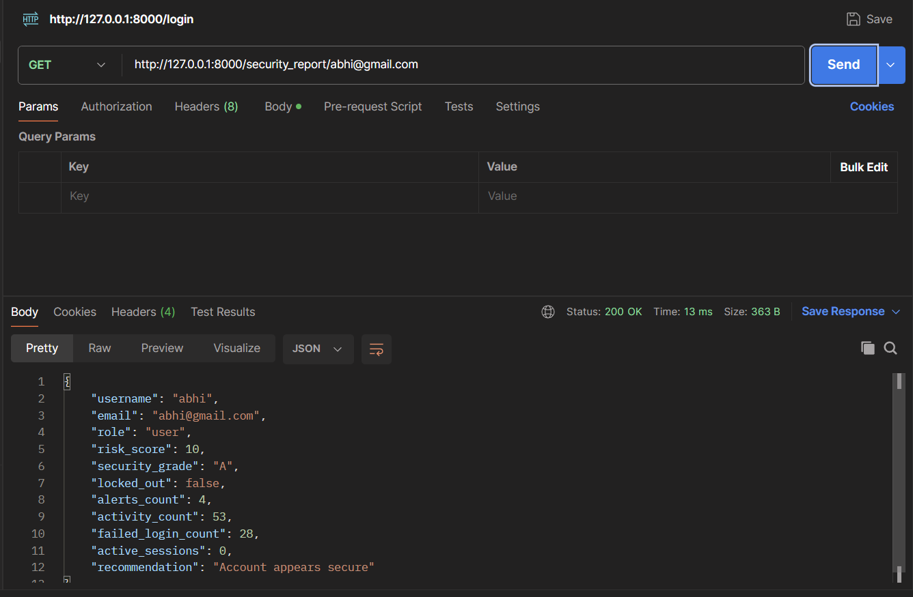

# AegisNet

A security monitoring and threat detection backend built with FastAPI and PostgreSQL.

## Features

- JWT Authentication
- Role Based Access Control
- Activity Logging
- Failed Login Detection
- Alert Generation
- Risk Score System
- Account Lockout
- Session Tracking
- User Investigation APIs
- Security Dashboard
- Security Reports

## Tech Stack

- Python
- FastAPI
- PostgreSQL
- SQLModel
- JWT
- Bcrypt

## Project Status

Version 1 Complete.

## Architecture Diagram

## Screenshots

### Dashboard

### Investigation

### Login

### Security Report

### live API

swagger documentation:
https://aegisnet-production.up.railway.app/docs

status:online.